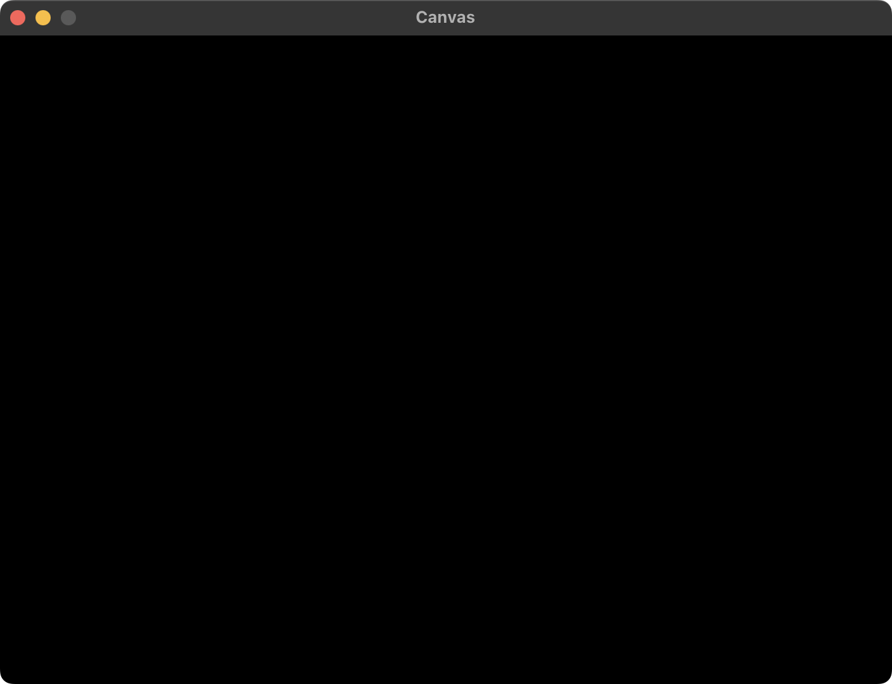
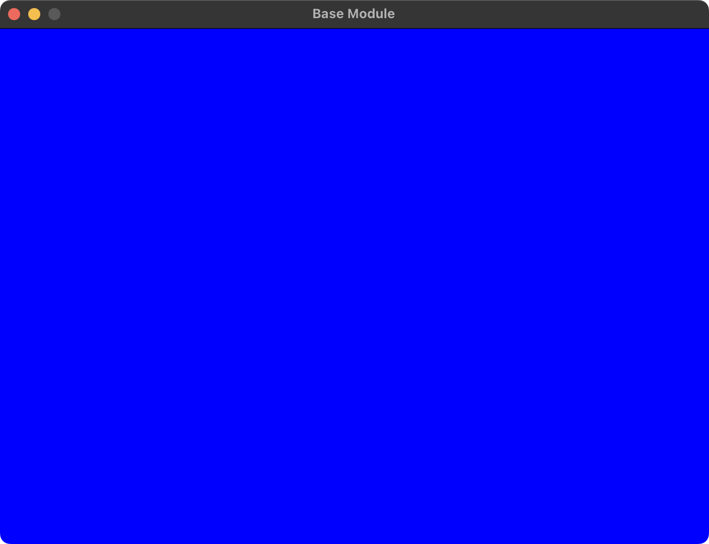

# Framework

## Canvas

\------------frame----------- 
|&emsp;&emsp;&emsp;&emsp;&emsp;&emsp;&emsp;&emsp;&emsp;&emsp;&emsp;&emsp;&nbsp;&nbsp;&nbsp;&thinsp;| 
|&emsp;&emsp;&emsp;&emsp;&emsp;screen&emsp;&emsp;&emsp;&emsp;&nbsp;&nbsp;&thinsp;&thinsp;| 
|&emsp;&emsp;&emsp;&emsp;&emsp;&emsp;&emsp;&emsp;&emsp;&emsp;&emsp;&emsp;&nbsp;&nbsp;&nbsp;&thinsp;| 
\-----------------------------

Canvas consists of frame and screen. 
(Frame is perimeter of screen.)

 

## Base Module

\------------frame----------- 
|&emsp;&emsp;&emsp;&emsp;&emsp;&emsp;&emsp;&emsp;&emsp;&emsp;&emsp;&emsp;&nbsp;&nbsp;&nbsp;&thinsp;| 
|&emsp;&emsp;&emsp;&emsp;&emsp;screen&emsp;&emsp;&emsp;&emsp;&nbsp;&nbsp;&thinsp;&thinsp;|------------Base Module 
|&emsp;&emsp;&emsp;&emsp;&emsp;&emsp;&emsp;&emsp;&emsp;&emsp;&emsp;&emsp;&nbsp;&nbsp;&nbsp;&thinsp;| 
\-----------------------------

Connected to canvas

 

## Stage 1

## Stage 2

