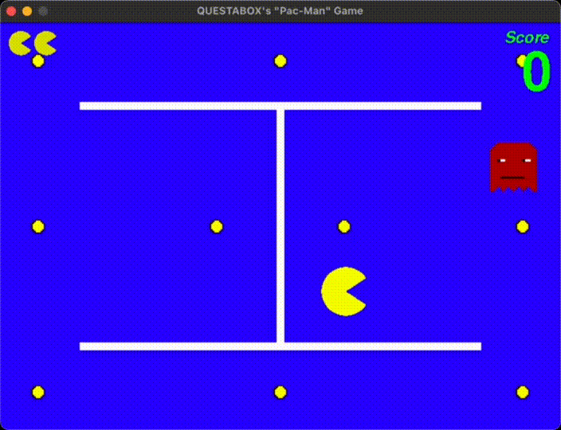
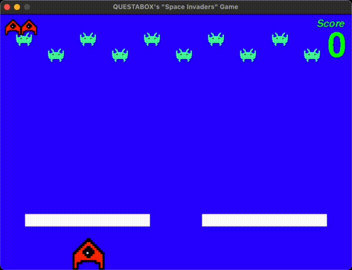
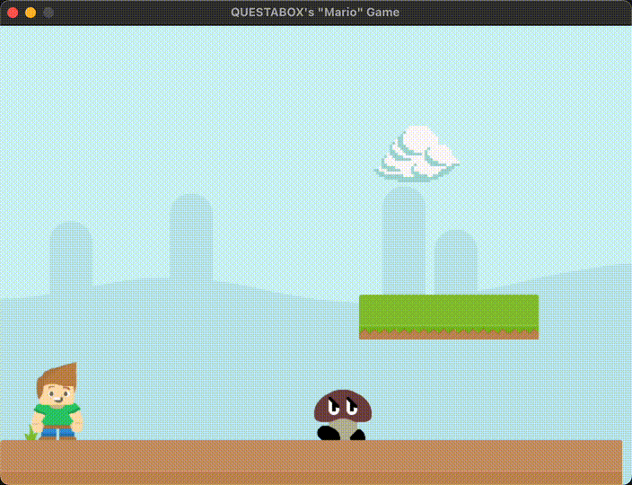

# My Projects (Test Change)

## Suburb Drawing

## Billiards Animation
 
(bump sound muted)

## Snowfall Animation
 
(background music muted)

## "Pictionary" Game

## "Pac-Man" Game
 
(sounds muted)

## "Space Invaders" Game
 
(sounds muted)

## "Mario" Game
 
(sounds muted, utilizes sprite sheets)

# Known Issues
* drawing a heart manually is difficult
* "ghost" sprites may still get stuck in extremely unusual circumstances